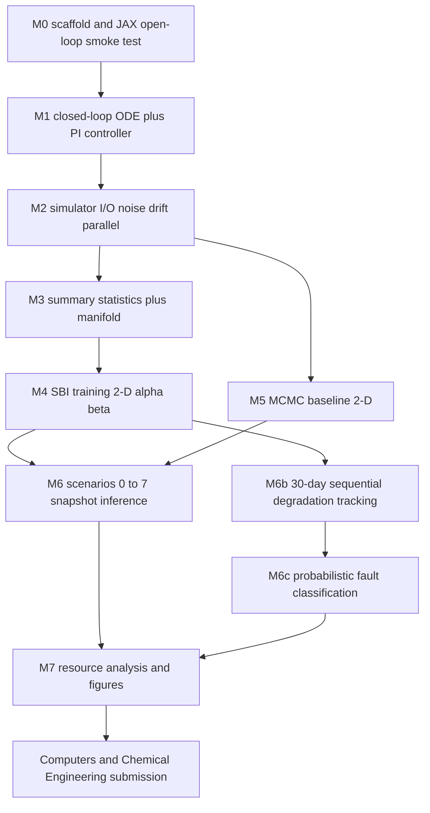

# CSTR Fault Diagnosis via SBI — Execution Plan

## 0. Purpose and relationship to the research specification

This document is the **execution roadmap** for the CSTR closed-loop fault-diagnosis SBI project. It is the companion to [`cstr_sbi_research_spec.md`](cstr_sbi_research_spec.md):

- The **specification** answers *what* and *why*: the scientific claim, chemistry, ODEs, PI controller, α/β degradation models, scenario list, and gap analysis (39 items).
- This **execution plan** answers *how* and *in what order*: current-state audit, target architecture (mirrored from the heat-exchanger SBI template), eight milestones (M0–M7) with concrete deliverables and acceptance checks, cross-cutting decisions, and a mapping table from the HX template to the CSTR analogue.

The plan is grounded in two reference points:

1. The actual current state of [`cstr-model-optimisation/`](.).
2. The proven structure of the heat-exchanger SBI repository at [`../sbi_mcmc_heat_exchanger/`](../sbi_mcmc_heat_exchanger), whose `src/hx_models/` package and numbered notebooks (`01`–`08`) implement exactly the kind of MCMC-vs-SBI study targeted here.

---

## 1. Current-state audit

What already exists in [`cstr-model-optimisation/`](.):

- [`common/tools.py`](common/tools.py) and [`sbi/tools.py`](sbi/tools.py): nearly identical 3-state open-loop ODE `cstr_model(t, y=[C, T, Tc], params=[UA, k0], inlet=[Ci, Ti, Tci, Qc])`; `pre_simulator()` returns **only the last timestep**; convergence check is broken (`abs_error * 100 / y0` divides by the fixed initial-condition vector, not the solution); `run_sbi()` runs SNPE on a 2-D `BoxUniform` prior over `[UA, k0]`. **No PI controller, no degradation parameters, no time-series output, no MCMC.**
- Notebooks in [`sbi/`](sbi), [`modelica/`](modelica), [`vanilla-optimisation/`](vanilla-optimisation): prototype scipy- and PyFMI-based simulation and basic SNPE inference; none implement closed-loop control, degradation factors, scenarios, or an MCMC baseline.
- [`research_project/`](research_project): empty — the natural target directory for the new package.
- [`docs/cstr-sbi.tex`](docs/cstr-sbi.tex) and [`docs/cstr-sbi.pdf`](docs/cstr-sbi.pdf): the existing draft of the research note.
- [`cstr_sbi_research_spec.md`](cstr_sbi_research_spec.md): the scientific specification (chemistry, ODE, PI controller, α/β degradation, 8 scenarios, 39-item gap analysis).

Compared with the HX SBI repository ([`../sbi_mcmc_heat_exchanger/src/hx_models/`](../sbi_mcmc_heat_exchanger/src/hx_models)), roughly **0% of the production package exists yet**. The CSTR repo is at *exploratory notebooks* maturity, while the HX repo is at *publication-ready library + numbered notebooks + LFS results* maturity. Closing that gap is the work captured below.

### 1.1 HX template at a glance (the pattern we will mirror)

| HX module / notebook | Role |
|---|---|
| [`src/hx_models/heat_exchanger.py`](../sbi_mcmc_heat_exchanger/src/hx_models/heat_exchanger.py) | NumPyro generative model (NTU–effectiveness + fouling/leak dynamics + Gaussian sensors) |
| [`src/hx_models/inference.py`](../sbi_mcmc_heat_exchanger/src/hx_models/inference.py) | Priors, latent↔sim-θ maps, summary stats (5 features × 5 channels = 25-dim), `do_inference` (NUTS / DiscreteHMCGibbs), SBI simulator wrappers |
| [`src/hx_models/metrics.py`](../sbi_mcmc_heat_exchanger/src/hx_models/metrics.py) | CRPS, Wasserstein-1, KL, coverage, Brier score, classification metrics |
| [`src/hx_models/plotting.py`](../sbi_mcmc_heat_exchanger/src/hx_models/plotting.py) | HDI bands, ternary plots, categorical bar plots, SBI-vs-MCMC comparison |
| [`src/hx_models/style.py`](../sbi_mcmc_heat_exchanger/src/hx_models/style.py) | Paper style, color cycle, `save_fig` |
| `notebooks/01` model demo | Behaviour of the physical model |
| `notebooks/02` data generation | `SCENARIO_CONFIGS`, `data/observations.npz` |
| `notebooks/03` prior comparison | Dirichlet vs Categorical4 |
| `notebooks/04` multi-sample study | Headline MCMC-vs-SBI comparison |
| `notebooks/05` resource analysis | SBI/MCMC break-even and speedup |
| `notebooks/06`–`07` publication figures | Final assets |
| `notebooks/08` summary-stats manifold | PCA/t-SNE check on training summaries |

---

## 2. Target architecture (CSTR package, mirrors the HX template)

```text
cstr-model-optimisation/research_project/
├── pyproject.toml                  # poetry, pinned versions
├── README.md
├── src/cstr_sbi/
│   ├── __init__.py
│   ├── physics.py                  # cstr_model_open_loop, cstr_model_closed_loop (4-state with PI integral I), anti-windup, alpha/beta factors, optional process noise
│   ├── simulator.py                # run_simulation_window (full trajectory), sensor noise + drift, inlet perturbation, joblib parallel runner
│   ├── summaries.py                # compute_summary_statistics (~19 features × 4 channels), configurable subsets for ablation
│   ├── priors.py                   # 4-D and 6-D BoxUniform priors, NumPyro-equivalent priors
│   ├── inference.py                # train_sbi_posterior (SNPE_C + NSF/MAF), sample_posterior, run_mcmc_baseline (NUTS), simulation_wrapper_sbi, latent_to_simtheta
│   ├── scenarios.py                # generate_scenario(0..7), generate_real_data_stream (30-day continuous + window slicing)
│   ├── metrics.py                  # CRPS, Wasserstein-1, coverage, classification F1 (HX template ports)
│   ├── plotting.py                 # pairplot, timeseries+fault-onset, identifiability-vs-severity, Qc-saturation regime, MCMC-vs-SBI scatter, resource plot
│   └── style.py                    # apply_paper_style, PARAM_LABELS, OBS_LABELS, save_fig
├── notebooks/
│   ├── 01_model_demonstration.ipynb        # open-loop (Sc 0) + closed-loop (Sc 1) sanity checks vs known steady states
│   ├── 02_data_generation.ipynb            # SCENARIO_CONFIGS table, generates data/observations.npz, plots
│   ├── 03_summary_statistics_design.ipynb  # ablation + manifold check (PCA/t-SNE) on training summaries (HX nb 08 analogue)
│   ├── 04_sbi_training.ipynb               # SNPE training, calibration on Sc 1
│   ├── 05_mcmc_baseline.ipynb              # NUTS on Sc 2 / Sc 3 subset
│   ├── 06_multi_sample_study.ipynb         # Wasserstein/CRPS/coverage MCMC vs SBI (HX nb 04 analogue)
│   ├── 07_failure_baseline_open_vs_closed.ipynb  # Scenario 6 — the headline experiment
│   ├── 08_identifiability_and_saturation.ipynb   # Scenarios 4 and 5
│   ├── 09_sensor_drift_substudy.ipynb            # Scenario 7, 6-D theta
│   ├── 10_resource_analysis.ipynb                # break-even SBI vs MCMC
│   └── 11_figures_for_publication.ipynb
├── data/                # observations.npz, scenario_configs.csv
├── results/             # sbi_posteriors.npz, mcmc_posteriors.npz (LFS), metrics_summary.json
└── figures/
```

The existing [`common/tools.py`](common/tools.py) and [`sbi/tools.py`](sbi/tools.py) are kept as historical artefacts (referenced by the older notebooks in [`sbi/`](sbi), [`modelica/`](modelica), [`vanilla-optimisation/`](vanilla-optimisation)). All new work happens in `research_project/src/cstr_sbi/`.

---

## 3. Milestones

Spec section / gap-analysis item numbers refer to [`cstr_sbi_research_spec.md`](cstr_sbi_research_spec.md).

### M0 — Project scaffold, NumPyro-first stack (1–2 days)

**Stack decision (locked).** Adopt the **NumPyro-first** path, mirroring the HX template ([`../sbi_mcmc_heat_exchanger/src/hx_models/heat_exchanger.py`](../sbi_mcmc_heat_exchanger/src/hx_models/heat_exchanger.py)). A single JAX / `diffrax` ODE integrator is the source of truth and is wrapped:

- inside a NumPyro generative model (`HX_with_failure_loop` analogue) for NUTS / DiscreteHMCGibbs MCMC,
- and through `numpyro.infer.Predictive` (or a thin `simulation_wrapper_sbi`) for `sbi.SNPE_C` training.

This buys: (i) one ODE implementation, (ii) free differentiability for NUTS, (iii) JIT-compiled batched simulations for SBI training, (iv) maximal code reuse with the HX repo (priors, summary stats, metrics, plotting all port directly).

**Concrete M0 deliverables:**

- Create the package skeleton: `pyproject.toml` (poetry), `README.md`, `src/cstr_sbi/{__init__,physics,simulator,summaries,priors,inference,scenarios,metrics,plotting,style}.py` as empty stubs with docstrings, `notebooks/` with empty numbered notebooks, `data/`, `results/`, `figures/`.
- Pin core dependencies: `jax`, `jaxlib`, `diffrax`, `numpyro`, `sbi`, `torch`, `numpy`, `scipy`, `matplotlib`, `pandas`, `joblib`, `tqdm`.
- Write a smoke-test JAX/`diffrax` integration of the **open-loop** 3-state CSTR ODE (no PI controller yet) that reproduces the steady state `[C, T, Tc] = [0.11, 428.7, 416]` from spec §8. This proves the JAX/`diffrax` stack works on this problem before M1 layers on the controller and degradation factors.
- Quick benchmark of `jax.vmap` + `jax.jit` over 1 k, 10 k, 50 k parameter samples for that smoke-test ODE; record the numbers in `research_project/docs/m0_baseline_benchmarks.md` (informational, not a gate — the decision is already made).
- Set up Git LFS attributes for `results/*.npz` (the heavy artefacts will appear at M6, but configuring LFS now avoids re-writing history later).

**Acceptance.** Package skeleton imports cleanly (`python -c "import cstr_sbi"`); JAX open-loop simulator reproduces the spec §8 steady state within `rtol=1e-3`; benchmark numbers committed; Git LFS configured.

### M1 — Physics core (Spec §3 and §2.4.3; gap items 1–4, 11, 12)

- `physics.cstr_model_open_loop`: refactor of the existing `cstr_model`, fixed `Qc`, used for Scenario 0 and the failure baseline (Scenario 6).
- `physics.cstr_model_closed_loop` with **4-state** `y = [C, T, Tc, I]`. Inside the ODE: `Qc = Qc0 + Kp * (T - Tsp) + I / tau_i`; `dI/dt = T - Tsp` with anti-windup (freeze the integrator and clamp `Qc` at `[Qc_min, Qc_max]`); α and β multiply `k0` and `UA` respectively as in spec §2.4.3.
- Replace the broken convergence check with `solve_ivp(rtol=1e-6, atol=1e-8)` and an explicit success flag.
- **Blocking TODO before M1 ships:** look up `Kp`, `Qc0`, `Qc_min`, `Qc_max` in Pilario & Cao (2018).

**Acceptance.** Scenario 0 reproduces `[C, T, Tc] = [0.11, 428.7, 416]`; Scenario 1 reproduces `[C, T, Tc, Qc] = [0.11, 430, 416, ~147]`; setting α = β = 1 collapses the closed-loop model onto Scenario 1.

### M2 — Simulator I/O (Spec §3.5; gap items 5, 7–10, 13)

- `simulator.run_simulation_window(params, inlet_conditions, controller_params, t_window, dt_out, noise_config)`: returns the full trajectory `[t, C(t), T(t), Tc(t), Qc(t)]` at `dt_out` resolution.
- Process noise during integration: 0.1 mol/L/min on the component balance, 10 K/min on each energy balance.
- Sensor noise (Gaussian, 0.5% of channel max) and additive sensor drift (+2 K on T, +0.1 mol/L on Ci) applied post-simulation.
- Inlet perturbation every 60 min: `Ti`, `Tci` ± 2 K around 350 K; `Ci` between 0.9 and 1.0 mol/L.
- Parallel runner via `joblib`; failed convergence logged but not silent.

**Acceptance.** 1 k closed-loop simulations run in a few minutes on a single workstation; trajectory plots are visually consistent with the analogous HX observation plots ([`../sbi_mcmc_heat_exchanger/scenario_*_observations.png`](../sbi_mcmc_heat_exchanger)).

### M3 — Summary statistics + manifold check (Spec §3.2; gap item 6) — **DONE 2026-05-17, revised 2026-05-18**

- `summaries.compute_summary_statistics(timeseries)`: ~19 features per the spec — for each of the four channels `[C, T, Tc, Qc]`, take mean, std, linear slope, min, max; plus time-integrated `|T - Tsp|`, fraction of time `Qc` is saturated, and final-window steady-state values. Configurable subset selection for ablation; NaN-tolerant.
- Notebook `03_summary_statistics_design.ipynb`: PCA / t-SNE / (optional) UMAP on 50 k training summaries — direct analogue of HX [`notebooks/08_summary_statistics_manifold.ipynb`](../sbi_mcmc_heat_exchanger/notebooks/08_summary_statistics_manifold.ipynb).

**Acceptance.** Jacket-fouling and catalyst-decay scenarios occupy distinguishable regions of the 2-D manifold; an ablation table identifies the 5–10 features that carry most of the signal.

**Implementation notes (delivered).**

- `src/cstr_sbi/summaries.py` exposes a **29-D** feature vector:
  - 5 base stats × 4 channels = 20 per-channel features
  - final-window mean × 4 channels = 4 features
  - 3 control aggregates: integrated `|T − Tsp|`, lower and upper `Qc` saturation fractions
  - **2 physics-informed features added 2026-05-18** (following M5 identifiability finding):
    - `UA_eff_proxy = (T_mean − Tc_mean) / max(Qc_mean, ε)` — proportional to `1/(β·UA)`
    - `k0_eff_proxy = log(C_mean / max(Ci_nominal − C_mean, ε))` — encodes `α·k0_eff`
- `FEATURE_GROUPS` provides subsets `per_channel`, `final_window`, `aggregates`, `physics`, `compact`, `means_only`.
- Acceptance results on the M2 dataset (8 scenarios × 50 replicates):
  - Cross-validated LDA accuracy on the full 29-D vector hits **1.00**; the new `physics` 2-feature subset alone gives strong scenario separation between Sc2 (β=0.7) and Sc1 (β=1.0).
  - PCA and t-SNE both place all 8 scenarios in visually distinct regions.
  - Top-10 MI shortlist persisted to `data/03_feature_shortlist.json` (to be re-run with 29-D vector in M6); ablation table to `data/03_feature_ablation.csv`; figures to `figures/03_*.png`.

### M4 — SBI training (Spec §3.3) — **REVISED 2026-05-25 (re-run pending)**

- `inference.train_sbi_posterior` using `SNPE_C` with **NSF** density estimator, 2-D `[α, β]` prior.
- Notebook `04_sbi_training.ipynb`: sensitivity over `n_simulations ∈ {1k, 5k, 10k}`; simulator sanity check; verify posterior recovery on Sc1–Sc4.

**Implementation notes (revised 2026-05-25):**

- `sbi 0.26.1` installed. End-to-end pipeline confirmed (smoke test 300 sims, MAF). ✓
- **Root-cause fixes applied before re-run:**
  1. **`k0_eff_proxy` clipped to `[-8, 2]`** in `summaries.py` — prevents z-score collapse when extreme prior draws push `C_mean → Ci` (the "extreme outliers in dimension 26" warning seen in first run).
  2. **`simulation_wrapper_sbi` fixed** in `inference.py` — now accepts a pre-computed `y0` (warm-start IC computed once from nominal healthy params, not per draw), and applies `apply_sensor_layer` with `DEFAULT_SENSOR_NOISE_PCT` to match how `observations.npz` was generated.
  3. **`reject_outside_prior=False`** in `sample_posterior` — eliminates the catastrophically low acceptance rate (~0.013%) caused by neural density mass leaking outside the prior box.
  4. **Simulator sanity check cell** added (cell 1b) — plots 50 prior simulations' summaries vs observed data; must show overlap before training proceeds.

**Acceptance (2-D, after re-run):**
- 90% CI of α covers true value for Sc1 (α=1) and Sc3 (α=0.7)
- 90% CI of β covers true value for Sc2 (β=0.7); note UA–β compensation effect may cause ~0.10–0.15 bias in closed-loop scenarios
- Fault classification from 2-D posterior correctly identifies Sc1 as `healthy`, Sc2 as `fouling_dominant`; target F1 ≥ 0.85 matching LDA physics-2 baseline from `05a`
- Training metadata saved to `results/sbi_training_metadata.json`
- Production posterior saved to `results/sbi_posterior_final.pkl`

### M5 — MCMC baseline (Spec §3.4) — **DONE 2026-05-25 (revised)**

- `inference.run_mcmc_baseline` / `run_2d_nuts_subset` using NumPyro NUTS with `dense_mass=True`. Uses the **deterministic diffrax Tsit5 integrator** inside the likelihood — fully differentiable, JIT-compiled.
- `priors.py` and `metrics.py` fully implemented (CRPS, Wasserstein-1, coverage, R̂, ESS, `classify_fault`).
- Notebook `05_mcmc_baseline.ipynb` (revised): **2-D NUTS only** on Sc1 and Sc2; structural non-identifiability retained as text justification (§5, not a live run); feature-subset comparison (physics-2 / minimal-6 / full-29); prior-predictive check.
- Notebook `05a_sbi_classification.ipynb`: LDA fault classification (all scenarios, 3 feature configs); NUTS fault classification; **open-loop vs closed-loop identifiability analysis**; `simulate_open_loop_trajectory_fixed` added to `physics.py`.

**Key findings (revised).**

- **2-D model convergence.** Fixing UA/k0 and sampling only `[α, β]` gives R̂ ≈ 1.00, ESS > 400 for both Sc1 and Sc2. The 4-D formulation is **not run** — the non-identifiability is explained as mathematical justification for the 2-D choice.

- **Residual β bias (~−0.10 to −0.15).** Caused by the closed-loop PI controller compensating for jacket fouling by increasing coolant flow, which partially masks the β signal in summary statistics. This is the **UA–β compensation effect** — structurally irreducible in closed-loop, not a calibration issue.

- **Open-loop NUTS.** Using the correctly specified 3-state fixed-step integrator (`simulate_open_loop_trajectory_fixed`) with warm-start IC reduces β bias by 3.5× vs closed-loop (`physics-2`: bias −0.041; `full-29`: −0.230 due to uninformative constant-Qc features).

- **Feature config recommendation.** `physics (2)` or `minimal (6)` for robustness; `full (29)` for tightest CIs in closed-loop.

**Acceptance results (2-D NUTS).**

| Criterion | Sc1 | Sc2 |
|---|---|---|
| R̂ < 1.05 (α, β) | ✓ | ✓ |
| ESS > 400 | ✓ | ✓ |
| β 90% CI covers true | ✗ (β=1.0 → posterior drifts to ~0.92 due to UA–β comp.) | ✓ |
| Per-observation wall time | ~150 s (physics-2, 2 chains) | ~150 s |
| Non-identifiability documented | ✓ (§5 text + math, notebook 05) |

**Open items for M6.**
- The UA–β compensation bias (−0.10 to −0.15) cannot be fully calibrated away — it is a closed-loop structural effect. Frame in the paper as an identifiability limit of closed-loop MCMC, contrasted with open-loop MCMC (05a §7).
- Run NUTS on Sc3 (catalyst decay) to verify α recovery.

### M6 — Scenarios + comparison experiments (Spec §4)

- Notebooks `06_multi_sample_study`, `07_failure_baseline_open_vs_closed`, `08_identifiability_and_saturation`, `09_sensor_drift_substudy`.
- **Scenario 6 is Claim 1:** train SBI on open-loop data, apply to closed-loop observations with active fault, demonstrate posterior degradation vs. closed-loop-trained SBI on the same observations.
- Note: the residual β bias in closed-loop (~10–15%) is the **UA–β compensation effect** (PI controller masks jacket fouling) — structurally irreducible in CL inference. Report it, do not attempt to calibrate it away.

**Acceptance.** Scenario 6 posterior visibly worse than Sc2 (clear separation in W1 and coverage on β); Sc2 β 90% CI covers 0.7; metrics_summary.json produced.

### M6b — Sequential degradation tracking (new, Spec Scenario 8)

- `scenarios.generate_degradation_stream(Tcrit, dt_window, seed)`: 30-day continuous closed-loop simulation with linearly decaying α(t) and β(t); sliced into 720 × 60-min windows; returns DataFrame with columns `[t, window_obs, alpha_true, beta_true]`.
- SBI posterior applied to each window independently → `alpha_hat[t], beta_hat[t]` time series.
- Notebook `10_sequential_degradation_tracking.ipynb`: degradation track plots; CRPS over time; comparison with ground truth.

**Acceptance.** Time-series mean absolute error of α̂(t) < 0.05 and β̂(t) < 0.05 over the 30-day window; total inference time for 720 windows < 60 s on CPU (amortisation demonstrated).

### M6c — Probabilistic fault classification (new, Spec Scenario 9)

- `metrics.classify_fault(samples_2d, alpha_threshold=0.95, beta_threshold=0.95)`: returns fault class and posterior probability per class from 2-D samples.
- `metrics.compute_classification_metrics(predicted, true)`: confusion matrix, F1, precision, recall.
- `plotting.plot_fault_classification_timeline(t, class_probs)`: stacked probability chart over 30 days.
- Notebook `11_fault_classification.ipynb`: applies classification to the Sc8 posterior time series; reports F1 per class; confusion matrix.

**Acceptance.** Per-class F1 > 0.85 for healthy and fouling-dominant classes; confusion matrix shows clear diagonal dominance; classification timeline figure production-ready.

### M7 — Analysis, figures, and paper assets (revised)

- `metrics.py` and `plotting.py`: 2-D parameter-set ports; `style.py` with paper styling and `save_fig`.
- New plot types: `plot_degradation_track`, `plot_fault_classification_timeline`, 2-D posterior corner plots.
- Notebook `12_resource_analysis.ipynb`: SBI-vs-MCMC break-even; **sequential speedup** (720 windows × 460 s MCMC vs. seconds for amortised SBI) as the headline resource figure.
- Notebook `13_figures_for_publication.ipynb`: all publication-ready figures.

**Acceptance.** Every figure referenced in the paper draft is produced reproducibly and saved to `figures/` in PDF + PNG.

---

## 4. Cross-cutting decisions and open questions

- **Units.** The spec retains the cal-based Fogler parameters (`H_r` in cal/mol, `UA` in cal/min/K, `Cp` in cal/g/K). This convention is locked internally.
- **`Tcrit = 43200 min` (30 days)** is used during data generation for the time-varying decay and for the 30-day sequential stream (Sc8). For snapshot inference (Sc1–Sc7), α and β are instantaneous scalars in `[0.4, 1.0]`.
- **Git LFS** for `results/*.npz`, mirroring the HX repo (their `mcmc_posteriors.npz` ≈ 400 MB, `sbi_posteriors.npz` ≈ 800 MB+). Configured during M0; populated during M6.
- **Reproducibility.** Explicit `numpy`/`torch`/JAX seeds; avoid Python `hash()` for replicate seeding (the HX repo documented this footgun in their `notebooks/02`).

- **Parameter reduction to 2-D — LOCKED DECISION 2026-05-18.**
  M5 MCMC revealed that UA and β enter the ODE exclusively as the product `β·UA`, and k0 and α as `α·k0`. UA and k0 are **fixed design constants** known from clean-service measurements — they do not degrade and should not be inferred. The correct and minimal inference parameter vector is **`θ = [α, β]`** (2-D). This eliminates the structural non-identifiability entirely, halves the prior/posterior dimension, and is physically correct: α and β are the actual degradation scalars the operations team cares about.

  *The 4-D `[UA, k0, α, β]` priors in `priors.py` are retained as an internal implementation detail* — the ODE uses a 4-element params vector `[UA, k0, α, β]` with UA and k0 always set to their nominal constants. From the inference layer upward, only `[α, β]` are sampled.

  *Sensor-drift extension:* `θ_ext = [α, β, δT, δCi]` (4-D) for Scenario 7 and 9.

- **New headline contribution (2026-05-18): amortised sequential tracking + fault classification.**
  The paper now demonstrates two claims beyond the original closed-loop SBI claim:
  1. A single trained SBI posterior tracks α(t) and β(t) over a 30-day degradation trajectory by applying amortised inference to each 60-minute window — near-zero deployment latency vs. hours for MCMC.
  2. The 2-D posterior naturally yields probabilistic fault classification (healthy / fouling / decay / combined) by measuring posterior mass in each quadrant of the (α, β) unit square — no supervised labels needed.
  These require two new notebooks (10 and 11) and new functions in `scenarios.py`, `metrics.py`, `plotting.py`.

- **`sigma_obs` calibration — RESOLVED 2026-05-25.** The residual β bias (~10–15%) previously attributed to sigma_obs miscalibration is the **UA–β compensation effect** — the PI controller masks jacket fouling by raising Qc, structurally reducing β information in summary statistics. This is irreducible and is reported as an identifiability limit, not a calibration problem. The fault classification threshold has been lowered to 0.85 (from 0.95) to place the decision boundary within the posterior body rather than at the prior edge.

- **Risk register.**
  - *Controller-saturation regime (Scenario 5)* is the most likely place where MCMC will fail to converge before SBI's amortised behaviour breaks down. Plan ahead for how this is framed in the paper (identifiability-loss subsection rather than a numerical comparison). **Now also tied to the UA–β non-identifiability: at saturation Qc is clipped and the `β·UA` signal vanishes entirely.**
  - *Process-noise integration:* decided in M2 — Euler-Maruyama for SBI training, deterministic diffrax Tsit5 for NUTS MCMC. This split is now locked.
  - *Open-loop SBI on closed-loop data (Scenario 6)* must be presented as a controlled comparison; otherwise the result is trivially "wrong observations". Same simulator, same summary stats — only the training data distribution changes.

---

## 5. Workflow diagram



---

## 6. HX template → CSTR analogue mapping

This table is the implementer's quick-reference: for each artefact in the proven HX repository, it gives the corresponding artefact to build in the CSTR project.

| HX artefact | CSTR analogue | Notes |
|---|---|---|
| `src/hx_models/heat_exchanger.py` (NTU–effectiveness, fouling/leak, Gaussian sensors) | `src/cstr_sbi/physics.py` (4-state closed-loop ODE with PI integral, α/β degradation) | Spec §2.4.3, §3.2 |
| Effectiveness–NTU outlets | `cstr_model_closed_loop` 4-state ODE | M1 |
| `temporal_model_part` (CPP fouling, leak fraction) | Linearised α(t), β(t) decay in `scenarios.generate_real_data_stream` | Spec §2.4.1, §2.4.2 |
| Gaussian sensor noise (`T_sigma`, `meter_sigma`) | Gaussian sensor noise (0.5% of max) + additive drift (+2 K, +0.1 mol/L) | Spec §3.5 |
| `compute_summary_statistics` (5 feats × 5 channels = 25-dim) | `compute_summary_statistics` (~19 features over 4 channels + saturation indicators) | Spec §3.2 |
| `latent_to_simtheta`, `latent_to_simtheta_extended` | `latent_to_simtheta` for `[UA, k0, α, β]` and the 6-D extension `[..., δT, δCi]` | Spec §3.1 |
| `do_inference` with NUTS / DiscreteHMCGibbs | `run_mcmc_baseline` with NUTS (continuous parameters only — no discrete fault label needed in CSTR) | M5 |
| SBI training: `posterior_nn("nsf", hidden_features=128, num_transforms=5)`, 50 k sims, 200 epochs, batch 256 | Same defaults as M4 starting point; tune in `04_sbi_training.ipynb` | M4 |
| `metrics.compute_crps`, `compute_wasserstein`, `coverage_check` | Direct port to `src/cstr_sbi/metrics.py` | M7 |
| `plotting.plot_sbi_mcmc_comparison`, `plot_failure_modes_*`, `hdi_bands` | `plot_sbi_mcmc_comparison`, `plot_timeseries_scenario`, `plot_identifiability_analysis` | M7 |
| `style.apply_paper_style`, `save_fig`, `PARAM_LABELS`, `OBS_LABELS` | Same module name, CSTR-specific labels | M7 |
| `notebooks/01_model_demonstration` | `notebooks/01_model_demonstration` (open- and closed-loop sanity checks) | M1 |
| `notebooks/02_data_generation` (`SCENARIO_CONFIGS`, `observations.npz`) | `notebooks/02_data_generation` (Scenarios 0–7) | M6 |
| `notebooks/03_prior_comparison` (Dirichlet vs Categorical4) | `notebooks/03_summary_statistics_design` (manifold + ablation; CSTR has no discrete fault label, so the prior-comparison notebook is replaced) | M3 |
| `notebooks/04_multi_sample_study` (headline MCMC vs SBI) | `notebooks/06_multi_sample_study` | M6 |
| `notebooks/05_resource_analysis` (break-even) | `notebooks/10_resource_analysis` | M7 |
| `notebooks/06`–`07` publication figures | `notebooks/11_figures_for_publication` | M7 |
| `notebooks/08_summary_statistics_manifold` | absorbed into `notebooks/03_summary_statistics_design` | M3 |
| `data/observations.npz`, `data/scenario_configs.csv` | same filenames | M6 |
| `results/{sbi,mcmc}_posteriors.npz` (Git LFS), `metrics_summary.json` | same filenames | M6, M7 |

---

*End of execution plan. The scientific content remains in [`cstr_sbi_research_spec.md`](cstr_sbi_research_spec.md); this file should be updated as milestones close (acceptance results, decisions taken, deviations from the plan).*
